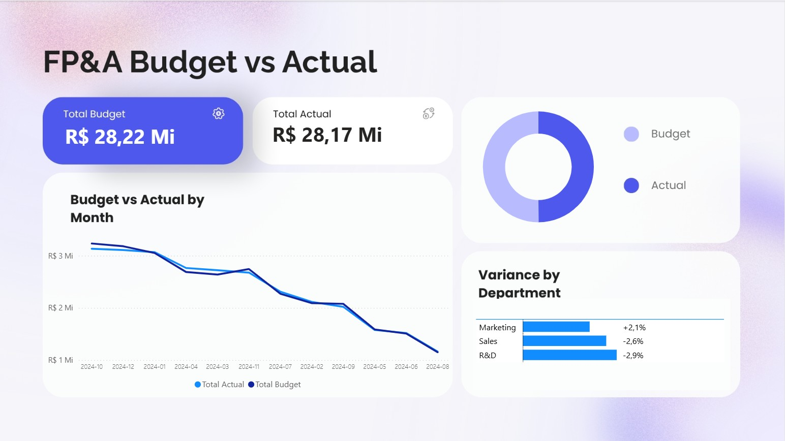

# FP&A Budget vs Actual Dashboard

Projeto de análise financeira com foco em FP&A / Controladoria, comparando valores orçados contra valores realizados por departamento e por mês.

## Objetivo

Analisar a performance financeira por meio de um dashboard executivo de Budget vs Actual, identificando variações, desvios por departamento e evolução mensal dos valores.

## Tecnologias utilizadas

- PostgreSQL
- SQL
- Python
- Pandas
- Power BI
- Canva
- Kaggle Dataset

## Pipeline do projeto

```text
Kaggle Dataset
↓
PostgreSQL
↓
SQL Extraction
↓
Python Transformation
↓
Power BI Dashboard
```

## Etapas realizadas

1. Carga dos dados brutos no PostgreSQL;
2. Extração dos dados com SQL;
3. Tratamento dos dados com Python/Pandas;
4. Criação de indicadores financeiros;
5. Criação de views analíticas em SQL;
6. Construção do dashboard no Power BI;
7. Design visual criado com apoio do Canva.

## Estrutura do projeto

```text
fpa-budget-vs-actual-dashboard/
│
├── dashboard/
│   └── dashboard.png
│
├── sql/
│   ├── 01_extract_fpa_variance.sql
│   ├── 02_create_views.sql
│   └── 03_validation_queries.sql
│
├── src/
│   ├── 01_load_csv_to_postgres.py
│   └── 02_transform_fpa_variance.py
│
├── .gitignore
└── README.md
```

## Principais indicadores

- Total Budget
- Total Actual
- Variance Amount
- Variance %
- Budget vs Actual by Month
- Variance by Department

## Dashboard



## Principais transformações

Durante o processo de tratamento dos dados, foram criadas colunas para apoiar a análise financeira, como:

- Data tratada do mês;
- Ano e número do mês;
- Variação absoluta entre Actual e Budget;
- Variação percentual recalculada;
- Classificação do status orçamentário;
- Classificação do nível de variação.

## Exemplo de query SQL

```sql
SELECT
    department,
    SUM(budget) AS total_budget,
    SUM(actual) AS total_actual,
    SUM(variance_amount) AS total_variance,
    ROUND(
        CAST(SUM(variance_amount) / NULLIF(SUM(budget), 0) AS numeric),
        4
    ) AS variance_pct
FROM fact_fpa_variance_clean
GROUP BY department
ORDER BY total_variance DESC;
```

## Aprendizados

Este projeto permitiu aplicar conceitos de FP&A, Controladoria, SQL, Python, modelagem de dados e construção de dashboards financeiros no Power BI.

## Autor

Desenvolvido por Luis Eduardo Baumel.
